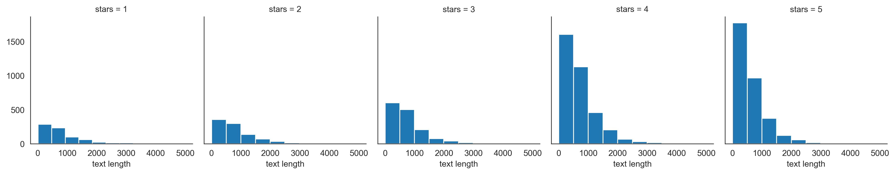
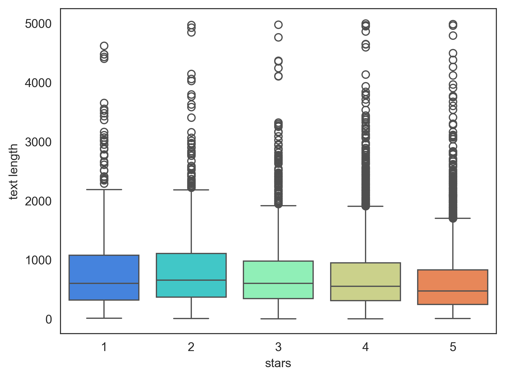
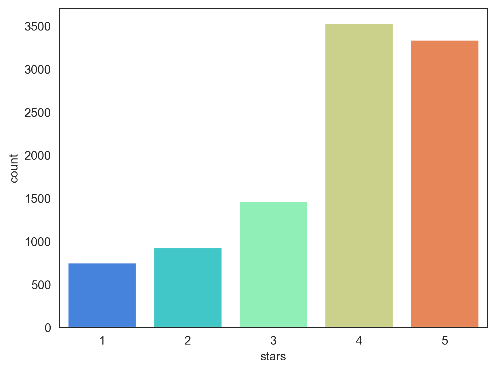
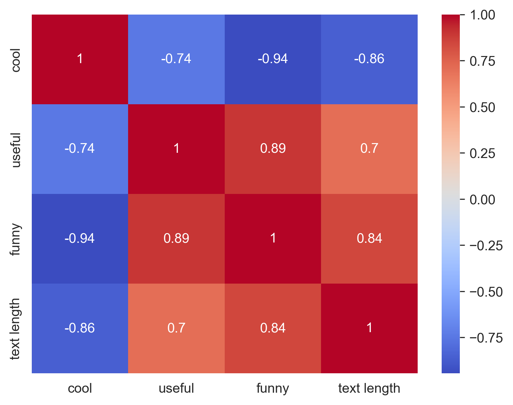
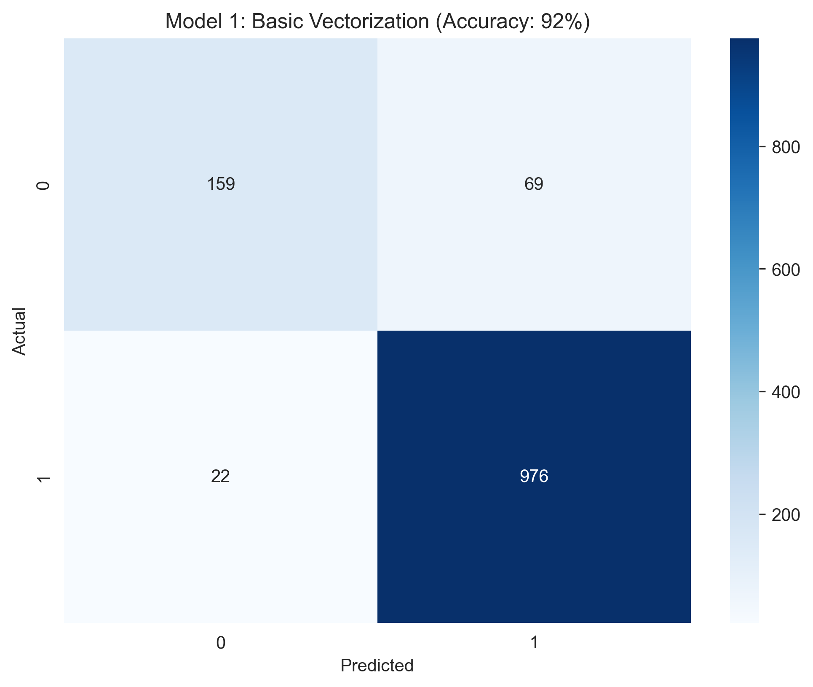
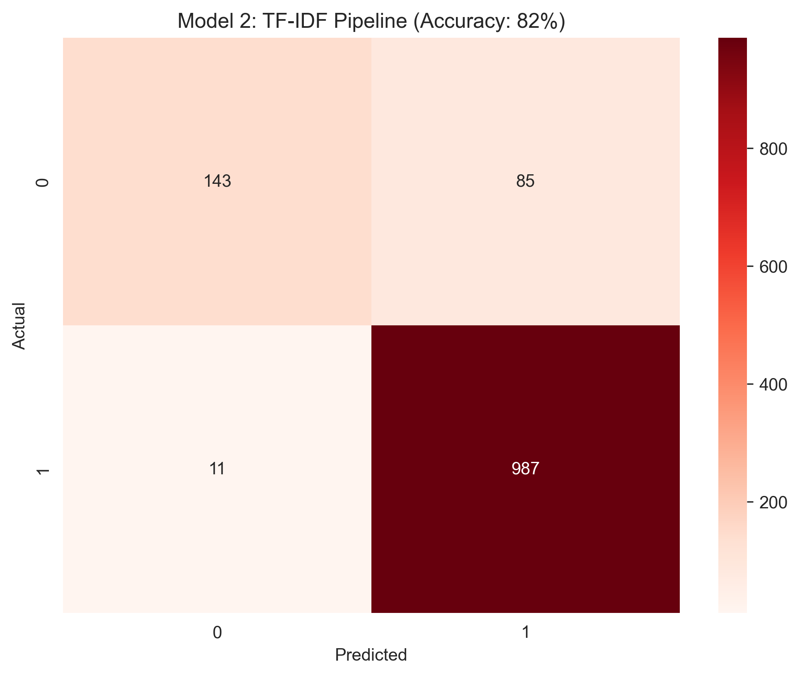

# **NLP Sentiment Analysis: Yelp Review Classification**
*Applying Natural Language Processing to categorize consumer sentiment and evaluating the effectiveness of TF-IDF pipelines.*

---

## **Project Overview**
This project classifies Yelp reviews into 1-star or 5-star categories based on text content. By analyzing a corpus of unstructured data, I built a system to predict consumer sentiment—a skill directly transferable to analyzing market sentiment or earnings call transcripts in a Global Markets context.

---

## **Exploratory Data Analysis (EDA)**
To ensure scientific rigor, I analyzed the text distributions to identify quantitative signals before building the classification models.

### **1. Text Length Distributions**

Analyzed how review length varies across star ratings to determine if verbosity correlates with sentiment.

### **2. Statistical Variance & Outliers**

Used boxplots to identify text length outliers and verify the spread of the data, ensuring a robust training set.

### **3. Class Balance & Feature Correlation**


I audited the dataset for class imbalance and examined the relationship between metadata (Cool, Useful, Funny) and text length.

---

## **Workflow & Technologies**
- **Text Cleaning:** Handled noise removal using NLTK (Stopwords, Punctuation).
- **Vectorization:** Applied `CountVectorizer` and explored `TfidfTransformer` pipelines.
- **Classification:** Leveraged **Multinomial Naive Bayes** for high-dimensional text classification.
- **Technologies:** Python, Pandas, Seaborn, Scikit-Learn.

---

## **The Experiment: Model Selection**
I conducted a controlled experiment to compare a baseline model against a complex TF-IDF pipeline.

### **Model 1: Basic Vectorization (Best Performer)**

* **Accuracy:** 92% — This approach captured the sentiment signals most effectively for this dataset.

### **Model 2: TF-IDF Pipeline (Experimental Failure)**

* **Accuracy:** 82% — Counter-intuitively, the TF-IDF approach decreased performance. This taught me that in NLP, more complex weighting can sometimes "wash out" important signals in shorter text reviews. I chose to move forward with the most efficient solution.

---

## **Key Takeaways**
* **Data Integrity:** Identified data skews and outliers before modeling.
* **Critical Thinking:** Documented the failure of a complex method to prove a commitment to mathematical accuracy over complexity.
* **Communication:** Translated raw classification reports into intuitive heatmaps.

---

## **How to Run**
```bash
pip install -r requirements.txt
jupyter notebook
